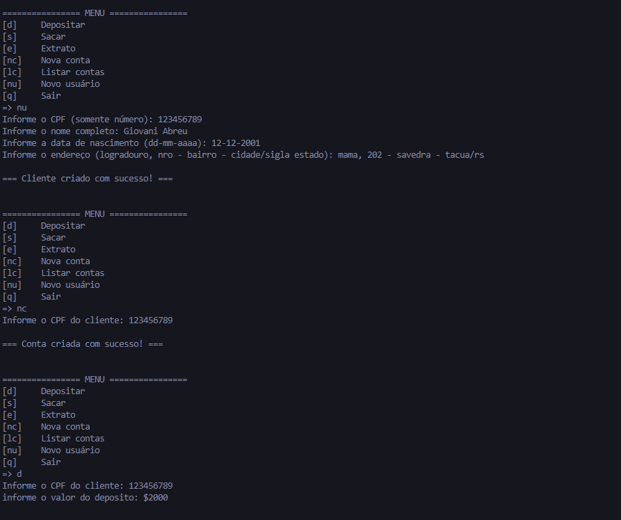
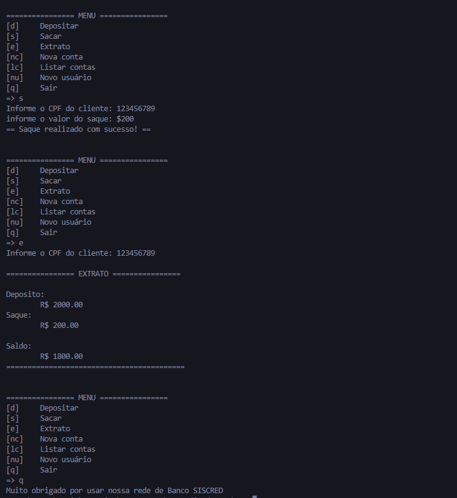

# Sistema bancario utilizando python 3
## Na nova actualização do projeto foi feita a implementação de usos de clases para criar o sistema bancario com mais funcionalidades e realista

### Ferramentas

- VSCode
- Python 3

### Resultados
#### Criação do usuario e conta. E o primero deposito

#### Saque da conta do cliente e mostrando o extrato

## Certificação

